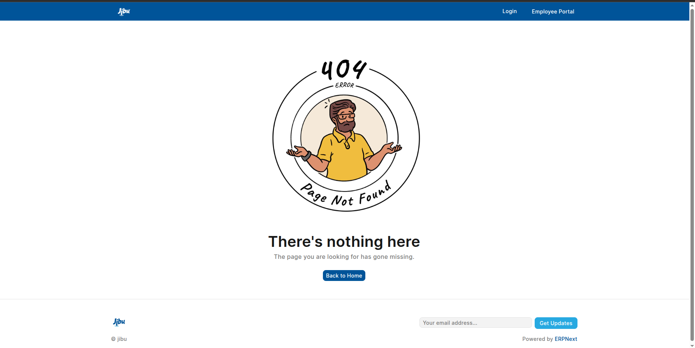

# Jibu 404 Experience Concept

A creative, interactive landing page designed as a conceptual "404 Error / Page Not Found" replacement for **Jibu** (a Pan-African water company).

https://jibu.byoosi.com/

This before-i-board-the-bus-project is heavily inspired by the tagline ("What is the Answer to your Thirst?") and minimal web development. This serves no purpose but to let my copywrite have breathing/swimming ground.

## Features

- **Interactive Spotlight Mask Reveal**: Hovering over the custom "parched man" illustration acts as a flashlight, dynamically cutting through the image to reveal Jibu's accurate 8-country operational map hidden underneath.
- **Scroll-Triggered Reveal**: A custom trickling bubble CSS animation intuitively prompts the user to scroll down. Using the `IntersectionObserver` API, scrolling triggers a smooth, cinematic reveal of the premium, dark-themed Jibu branding.
- **Infinite Flags Marquee**: An infinite-scrolling footer marquee built with CSS keyframes, showcasing the flags of all 8 countries Jibu proudly serves (Burundi, DRC, Ghana, Kenya, Rwanda, Tanzania, Uganda, Zambia).
- **Custom Assets**: Includes generated line-art illustration of an exhausted man and a highly specific vector map accurately highlighting Jibu's operational footprint across Central, East, and West Africa.
- **Clean Architecture**: Built purely with Vanilla HTML, CSS, and JS, bundled rapidly via Vite.

## Technologies

- HTML5
- CSS3 (Variables, Masks, Animations, Keyframes)
- Vanilla JavaScript (`IntersectionObserver`, DOM mapping)
- Vite (Development Server & Bundler)
- FlagCDN (Flag Asset Delivery)

## Design Philosophy

The aesthetic focuses on corporate elegance and cleanliness. Typography uses `Inter` for highly legible body/UI text, and `Playfair Display` for bold, premium emphasis. The layout intentionally separates a very clean, white hero page (the "Thirst" problem) from a stark, dark reveal page (the "Jibu" answer).
